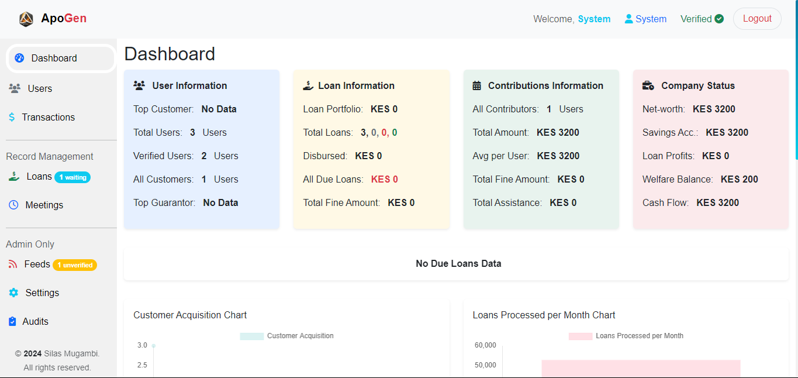

# Loan Management System




## Overview

The Loan Management System is a Flask-based web application meticulously crafted to efficiently handle loans, user accounts, and system settings. Whether born out of the needs of a local group or developed using Python, Bootstrap, JavaScript, CSS, HTML, and Jinja2, this GitHub repository houses an efficient solution designed to streamline the loan management process seamlessly. The system offers a user-friendly interface, making it a valuable tool for effective loan tracking and administration within various contexts.

## Table of Contents

- [Features](#features)
- [Getting Started](#getting-started)
  - [Prerequisites](#prerequisites)
  - [Installation](#installation)
  - [Running the Application](#running-the-application)
- [Usage](#usage)
- [Contributing](#contributing)
- [License](#license)
- [Acknowledgments](#acknowledgments)

## Features

- **User Authentication:** Allows users to easily register, log in, and log out.
- **Role-based Access Control:** Supports roles, including standard users and administrators.
- **Loan Operations:** Empowers users to apply for loans, access loan details, and monitor loan statuses.
- **Admin Panel:** Facilitates system administration by managing users, approving or declining loan applications, and more.
- **Membership and Verification:** Administrators can grant or revoke memberships and verify user details.

## Getting Started

### Prerequisites

Ensure you have the following installed:

- Python 3.x
- Flask
- SQLAlchemy
- Flask-WTF
- Flask-Bcrypt

### Installation

1. Clone the repository:

   ```bash
   git clone https://github.com/mugambi12/loan_management_system.git
   ```

2. Install dependencies:

   ```bash
   pip install -r requirements.txt
   ```

### Running the Application

1. Navigate to the project directory:

   ```bash
   cd loan-management-system
   ```

2. Run the application:

   ```bash
   python run.py
   ```

3. Open your web browser and go to [http://localhost:7070](http://localhost:7070).

## Usage

1. Register for an account or log in if you already have one.
1. Navigate through the user interface to apply for loans, view loan details, and manage your account.
1. Administrators can access the admin panel to manage users, approve or decline loan applications, and perform system administration tasks.

### Admin Login Details

To access the admin panel, use the following credentials. You will need to log in to the admin panel to verify the created account and grant login access.

- **Email:** admin@mail.com
- **Password:** Apogen@2023

Note: Please ensure the security of these credentials and change the password after the initial login.

## Contributing

We welcome contributions to improve the Loan Management System. If you'd like to contribute, please follow our contribution guidelines outlined below:

### Contribution Guidelines

1. Fork the repository.
1. Create a new branch for your contribution.
1. Make your changes and ensure they adhere to the project's coding standards.
1. Test your changes thoroughly.
1. Commit your changes with a clear and descriptive commit message.
1. Push your changes to your forked repository.
1. Submit a pull request to the main repository.

Our maintainers will review your contributions and provide feedback. Thank you for helping enhance the Loan Management System!

## License

This Loan Management System is provided under the [MIT License](LICENSE), making it free for use, modification, and distribution. However, please note that it is not for sale. Feel free to leverage, contribute, and enhance the system for your needs, in adherence to the terms of the MIT License.

## Acknowledgments

I extend my sincere gratitude to the following:

- The Flask community for providing an exceptional web framework that contributed significantly to the development of this project.
- [ALX Africa](https://www.alxafrica.com/) for their Software Engineering course, a pivotal resource that played a crucial role in my professional development.
- The GitHub community for their unwavering support, valuable feedback, and collaborative spirit, which greatly enriched the project.
- My friends and family for their continuous encouragement and steadfast support throughout the entire journey of this project.

---
